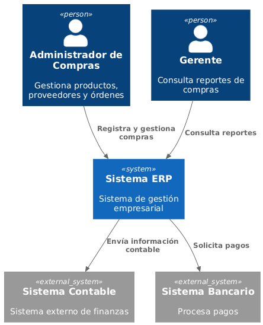
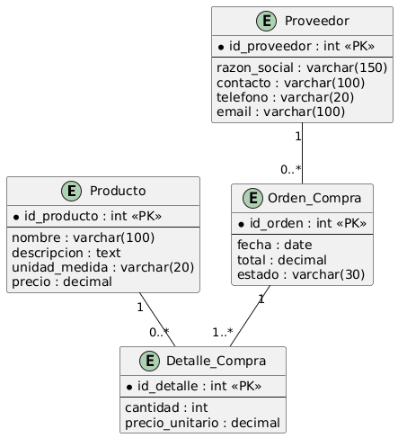

# Documentación de Arquitectura – Sistema ERP (Módulo de Compras)
Basado en la plantilla arc42

---

## 1. Introducción y Metas

### 1.1 Objetivo del Sistema

El Sistema ERP tiene como objetivo apoyar la gestión del módulo de compras,
permitiendo registrar productos, proveedores y controlar el inventario
de forma eficiente.

### 1.2 Requisitos de Negocio

- Registrar productos.
- Gestionar proveedores.
- Controlar inventarios.
- Registrar compras.
- Generar reportes.

### 1.3 Metas de Calidad

| Prioridad | Meta        | Descripción |
|----------|-------------|-------------|
| Alta     | Usabilidad  | Fácil uso   |
| Alta     | Seguridad   | Protección de datos |
| Media    | Rendimiento | Respuesta rápida |
| Media    | Escalabilidad | Crecimiento futuro |

---

## 2. Restricciones de Arquitectura

- Backend: Java con Spring Boot.
- Frontend: React (SPA).
- Base de datos: PostgreSQL.
- Comunicación: REST / JSON.
- Control de versiones: GitHub.

---

## 3. Alcance y Contexto del Sistema

### 3.1 Contexto de Negocio

El sistema interactúa con administradores y sistemas externos.

#### Diagrama de Contexto (C1)

### 3.2 Contexto Técnico

- Acceso vía navegador web.
- Comunicación HTTPS.
- API REST.

---

## 4. Estrategia de Solución

- Arquitectura monolítica.
- Separación Frontend / Backend.
- API centralizada.
- Base de datos relacional.

---

## 5. Vista de Bloques (Building Block View)

### 5.1 Nivel 1 – Sistema General

#### Diagrama de Contenedores (C2)

### 5.2 Descripción de Contenedores

| Contenedor       | Responsabilidad |
|------------------|------------------|
| SPA              | Interfaz usuario |
| API ERP          | Lógica negocio   |
| Base de Datos    | Almacenamiento   |

---

## 6. Vista de Ejecución (Runtime View)

### 6.1 Escenario: Registrar Producto

El administrador registra un nuevo producto en el sistema.

#### Diagrama de Secuencia

#### Flujo

1. El administrador ingresa datos.
2. El sistema valida información.
3. Se guarda en la base de datos.
4. Se confirma el registro.

---

## 7. Modelo de Datos (Entidad-Relación)

Este modelo representa la estructura del módulo de compras.

### Diagrama MER

---

## 8. Vista de Despliegue (Deployment View)

El sistema se despliega en un servidor centralizado:

- Servidor Web (Frontend).
- Servidor de Aplicaciones (Backend).
- Servidor de Base de Datos.

Todos conectados por red segura.

---

## 9. Conceptos Transversales

### Seguridad
- Autenticación por usuario.
- Control de roles.

### Arquitectura
- Patrón MVC.
- REST API.

### Desarrollo
- GitFlow.
- Documentación continua.

---

## 10. Decisiones de Diseño

| Decisión | Justificación |
|----------|---------------|
| Spring Boot | Rapidez desarrollo |
| React | Interfaz moderna |
| PostgreSQL | Estabilidad |

---

## 11. Requerimientos de Calidad

- Tiempo de respuesta < 2 segundos.
- Disponibilidad 99%.
- Seguridad de datos.

---

## 12. Riesgos y Deuda Técnica

- Dependencia tecnológica.
- Falta de automatización.
- Escalabilidad futura.

---

## 13. Glosario

| Término | Definición |
|---------|------------|
| ERP | Sistema de planificación empresarial |
| Producto | Artículo comercial |
| Proveedor | Empresa suministradora |
| Inventario | Control de existencias |
| API | Interfaz de programación |

---
